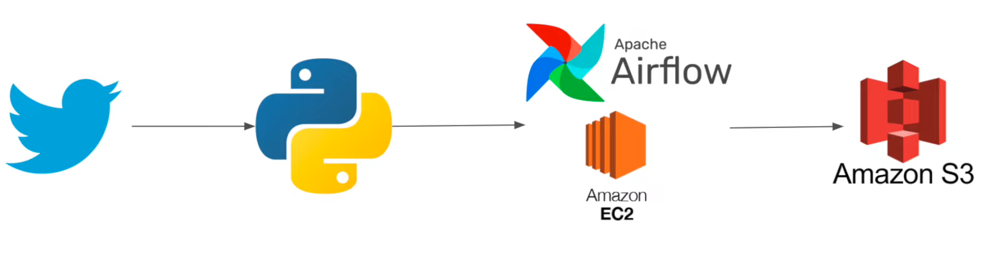

# Twitter Data Pipeline using Airflow

## Introduction 
In this project, i execute a End-To-End Data Engineering Project with Web Scraping Twitter Data Pipeline using Airflow.

I use different technologies such as Python, Shell, Amazon Web Services (AWS), ApacheAirflow.

## Architecture 

## Technology Used
- Python
- Shell
- Apache Airflow
- Amazon Web Service (AWS)
1. S3 (Simple Storage Service)
2. EC2

## Dataset Used
You can use any Twitter search, we are mainly interested in operation side of Data Engineering.
